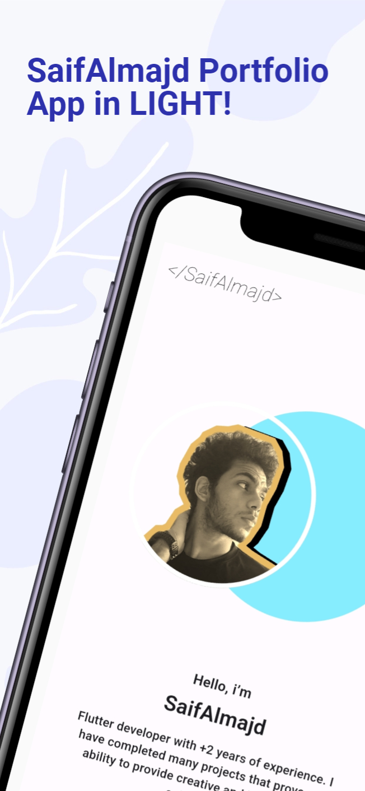

# SaifAlmajd Portfolio App

Welcome to the SaifAlmajd Portfolio App! This Flutter-based application is designed to showcase the talents and accomplishments of SaifAlmajd, a skilled Flutter developer. This app provides an interactive and visually appealing way to explore SaifAlmajd's professional journey, projects, and skills.

## Features

- **Portfolio Sections:** Explore SaifAlmajd's work organized into different sections such as Projects, Skills, and Achievements.

- **Project Details:** Dive into detailed information about each project, including descriptions, technologies used, and outcomes.

- **Skill Set:** View SaifAlmajd's proficiency in various technologies, programming languages, and tools.

- **Achievements:** Discover SaifAlmajd's notable accomplishments and contributions in the professional field.

- **Responsive Design:** The app is designed to provide a seamless experience across different devices and screen sizes.

- **Light and Dark Theme:** Based on your preference you can choose dark or light mode.


## Getting Started

To run the SaifAlmajd Portfolio App locally, make sure you have Flutter installed. Follow these steps:

1. **Clone the Repository:**
   ```bash
   git clone https://github.com/Syf-Almjd/app_portfolio
   ```

2. **Navigate to the Project Directory:**
   ```bash
   cd app_portfolio
   ```

3. **Run the App:**
   ```bash
   flutter run
   ```

## Technologies Used

- Flutter
- Dart

## Contributing

If you'd like to contribute to the SaifAlmajd Portfolio App, please follow these steps:

1. Fork the repository.
2. Create a new branch for your feature or bug fix.
3. Make your changes and submit a pull request.


### Screenshots

| Screenshot 1                                    | Screenshot 2                                    | Screenshot 3                                    |
|-------------------------------------------------|-------------------------------------------------|-------------------------------------------------|
|  |  |  |

| Screenshot 4                                    | S<br/>creenshot 5                               |
|-------------------------------------------------|-------------------------------------------------|
|  |  |


## Issues and Bugs

If you encounter any issues or find a bug, please report it in the [Issues section](https://github.com/Syf-Almjd/app_portfolio/issues) of the repository.

## License

This project is licensed under the [MIT License](LICENSE.md).

## Contact

For any inquiries or collaborations, please contact SaifAlmajd at [syfalmjd11@gmail.com](mailto:syfalmjd11@gmail.com).

Thank you for exploring SaifAlmajd's portfolio! Feel free to reach out for any additional information or feedback.


